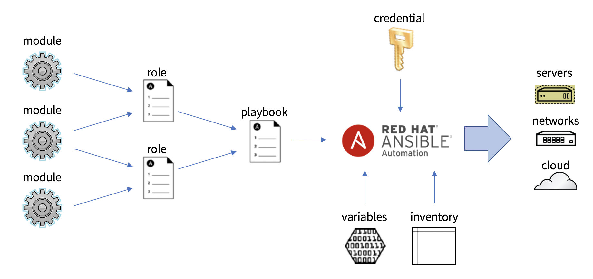

Ad-Hoc コマンドの実行

## 説明

Ansible ではモジュールと呼ばれる様々な部品を使って「自分のやりたいこと」を Playbook に記述していきます。モジュールは「よくある操作や手順」を部品化したものです。

通常はこのモジュールを集めたPlaybookとして使いますが、このモジュールを直接呼び出して実行することも可能です。これを Ansible では Ad-Hoc（アドホック）コマンドと呼びます。

まずいくつかのアドホック・コマンドを走らせてみます。Ansibleのアドホック・コマンドを利用すれば、Playbookを記述せずにリモート・ノード上でtaskを実行できます。アドホック・コマンドは、ちょとした事を様々なリモート・ノードで行う場合にとても便利です。

## 演習

### ステップ 1

まず最初は簡単なところで、ホストに対してpingを送ってみましょう。pingモジュールでホストの応答を確認できます。

`ansible web -m ping`{{execute}}

### ステップ 2

今度はcommandモジュールを使って基本的なLinuxコマンドを走らせ、その出力をフォーマットしてみます。

`ansible web -m command -a "uptime" -o`{{execute}}

### ステップ 3

利用しているWebノードのコンフィギュレーションを確認してみましょう。setupモジュールはAnsibleのエンドポイントの情報を表示します。

`ansible web -m setup`{{execute}}

### ステップ 4

では次にyumモジュールを用いてApacheをインストールしましょう。

`ansible web -m yum -a "name=httpd state=present" -b`{{execute}}

### ステップ 5

Apacheのインストールが終わったので、serviceモジュールを使って起動してみましょう。

`ansible web -m service -a "name=httpd state=started" -b`{{execute}}

これで制御対象のホストにHTTPDで設定されて起動したはずです。コンソールの上側のある `node-1` `node-2` ... という部分をクリックしてみてください。

このリンクは、制御対象のノードのポート80へアクセスするように設定されています。設定がうまくいっていれば、Apache の初期画面が表示されるはずです。

### ステップ 6

そして最後にクリーンナップします。まずhttpdサービスを停止しましょう。

`ansible web -m service -a "name=httpd state=stopped" -b`{{execute}}

### ステップ 7

そしてApacheパッケージを削除します。

`ansible web -m yum -a "name=httpd state=absent" -b`{{execute}}

